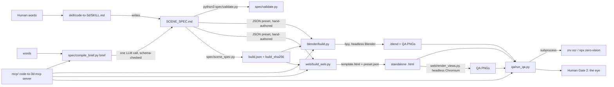

## Purpose

RealEngine turns a written scene spec into 3D output on two backends: Blender (`.blend` + QA PNGs) and Three.js (a standalone HTML page). It is used by an agent (or a human running the CLI directly) that has a brief, a `SCENE_SPEC.md`, or a build JSON ready. It is not a text-to-3D mesh generator and not a hosted service.

As of this commit all six MCP tools do real work: each runs the Python step that owns its job and returns that step's JSON receipt. A step whose dependency is absent (no Blender, no headless browser, no model endpoint configured) returns `ok:false` naming the dependency — never a silent fallback and never a fake result.

What the backends produce is a **blockout**: one named proxy volume per named object in the spec, at the spec's dimensions, in the spec's palette, with the spec's label text, under the spec's cameras. Nothing is invented from the subject matter. Modelled geometry is not in scope here.

## System diagram



```
words -> compile_brief.py brief  (the ONLY model call, schema-checked, 1 retry)
             |
             v
      SCENE_SPEC.md  --------------------------------> [HUMAN GATE 1]
             |  spec/scene_spec.py  (pure code, offline)
             v
      build.json + build_sha256   <- the pin; both backends read this file
             |
             +--> web/build_scene.py  -> scene.html + views.json
             |          |
             |          +--> web/render_views.py (headless Chromium) -> PNGs
             |
             +--> blender/run_headless.py -> build.py in bpy -> .blend + PNGs
                        |
                        v
             qa/run_qa.py --renders DIR --labels ... --json
                        | subprocess
                        v
                  zrv ocr (zero-vision)
                        |
                        v
                  [HUMAN GATE 2: the eye]
                        |
                        v
             tools/export_scene.py -> scene.zip + sha256 manifest

mcp/ server: 6 tools, each spawning the step above and returning its receipt.
```

## Components

| Component | File/dir | Job | Interface it exposes |
|---|---|---|---|
| Spec validator | `spec/validate.py` | Checks a `SCENE_SPEC.md` has all 6 required sections, well-formed hex colors, ≥1 camera, gapless build order | CLI: `python3 spec/validate.py <path>`, exit 0/1 |
| Spec round trip | `spec/scene_spec.py` | Parses `SCENE_SPEC.md` into the build dict both backends consume, emits it back as canonical Markdown (a fixpoint), computes placement and camera poses, pins the result with sha256 | CLI: `parse / emit / build / hash / roundtrip`; API: `parse_spec`, `emit_spec`, `to_build_json`, `build_hash`, `compile_spec` |
| Prompt→spec compiler | `spec/compile_brief.py` | `brief` drafts a spec from words (one model call, strict schema check, one feedback retry); `compile` turns a stored spec into build JSON + hashes, offline | CLI: `brief --prompt …`, `compile --brief-id/--spec …`; one-line JSON receipt on stdout |
| LLM client | `spec/llm.py` | The single networked call. OpenAI-compatible; base URL and key from env, no endpoint hardcoded; `REALENGINE_LLM_STUB` is the test hook and marks receipts `source:"stub"` | `chat(messages)`, `resolve_config(env)`, raises `LLMUnavailable` |
| Spec schema doc | `spec/SPEC-SCHEMA.md` | Normative shape of `SCENE_SPEC.md` | Markdown reference, no code |
| Blender lib | `blender/ctd_blender/{collections,materials,cameras,qa}.py` | Collection tree, material table, camera placement, QA render + stats — all `bpy`-lazy so the package imports without Blender | Python functions (see Interfaces) |
| Blender build entrypoint | `blender/build.py` | Reads the build JSON, drives `ctd_blender` inside Blender: collections → materials → blockout → lights → cameras → `.blend` → views | CLI inside Blender's Python; args come after a bare `--`. `--engine/--samples/--res-scale` for cheap proof frames |
| Blender wrapper | `blender/run_headless.py` | Finds a Blender binary (`REALENGINE_BLENDER`, PATH, macOS bundle), runs `build.py` inside it, turns `CTD_BUILD_DONE` into a receipt; exits 3 with the requirement when there is no Blender | CLI: `--spec build.json --out-dir DIR [--views …]` |
| Blender blockout + lights | `blender/ctd_blender/{blockout,lighting}.py` | One box per spec object (name, position, size, material); three-point rig + world background sized from the scene extent (scenes previously rendered black) | `build_blockout(objects, collections, materials)`, `three_point(scene, extent, center, cols)`, `setup_world(scene, hex)` |
| Web slot builder | `web/build_web.py` | Fills `{{slot}}` placeholders from a JSON preset, fails loud on any unbound or surviving slot. Still the gate under the generic builder | CLI: `python3 web/build_web.py <preset.json> <template.html> <out.html>` |
| Web scene builder | `web/build_scene.py` | Spec (or build JSON) → `scene.html` + `build.json` + `views.json` + a copy of the spec, via the generic template and the slot gate | CLI: `python3 web/build_scene.py <SCENE_SPEC.md\|build.json> --out-dir DIR` |
| Generic scene template | `web/template_scene.html` | The Three.js page: blockout meshes, HTML label overlay, collection toggles, palette legend, named camera buttons, `?view=/labels=/subs=/hud=` and `window.REALENGINE_READY` | Slot contract + query contract |
| View renderer | `web/render_views.py` | Headless Chromium (Playwright) drives the manifest and screenshots each named view at its resolution. Optional dependency: without it, no PNGs, exit 3, requirement stated | CLI: `--scene-dir DIR [--views …] [--scale …]` |
| Legacy brain template | `web/template.html`, `web/presets/brain.json` | The original hand-authored brain page, 171 slots. Kept, byte-diffed in CI | Slot contract |
| Scene exporter | `tools/export_scene.py` | Deterministic zip (fixed timestamps) of html + build.json + spec + views.json + renders, with a sha256 manifest; or one html/png | CLI: `--scene-dir DIR [--format zip\|html\|png]` |
| QA asserts | `qa/asserts.py` | `labels_present` (OCR via zero-vision subprocess), `views_match` (PNG dimension compare, stdlib PNG IHDR reader, no PIL), `no_overlap` (stub, raises `NotImplementedError`) | Python functions |
| QA CLI | `qa/run_qa.py` | Runs `labels_present` over every PNG in a directory | CLI: `python3 qa/run_qa.py --renders DIR --labels CSV`, exit 0 iff all pass |
| MCP server | `mcp/src/index.ts`, `mcp/src/handlers.ts` | Lists the 6 tools and runs them: each validates args, spawns the Python step that owns the job, and returns its JSON receipt. `REALENGINE_ROOT` / `REALENGINE_PYTHON` configure it | MCP stdio server, `brief / spec_compile / build / views / qa_assert / export_scene` |
| Skill | `skill/code-to-3d/SKILL.md` | The 9-step workflow an agent follows by hand (skill does not call the MCP server; it names the CLI scripts directly) | Skill frontmatter + body |
| Test suite | `tests/test_all.py`, `tests/golden/` | 31 stdlib `unittest` tests: validate.py, build_web.py, qa/asserts.py, blender import-safety, spec round trip against golden JSON/Markdown/hashes, the brief compiler (stubbed), and the web backend (slot-free page, drivable manifest, byte-identical rebuild) | `python3 -m unittest discover -s tests -p 'test_*.py'` |
| MCP test suite | `mcp/test/{smoke,tools}.test.js` | `smoke` checks the list, schema/handler agreement and arg validation with no I/O. `tools` drives all six tools through the real stdio transport, hermetic: golden spec stubs the drafter, a non-existent `REALENGINE_BLENDER` forces the no-Blender branch, views/qa get inputs with no manifest and no PNGs | `cd mcp && npm test` |
| Second example | `examples/desk-lamp/` | A hand-written spec for a subject that is not a brain: 6 objects, 4 cameras. Validates, round-trips, builds, renders, and is OCR-gated locally | Files only |
| Example scene | `examples/brain/` | The one real, finished scene: hand-built `SCENE_SPEC.md`, a chain of numbered ad hoc Blender scripts (`01_rebuild.py` … `11_final_adjustments.py`), and final renders/blends. Predates the generalized `ctd_blender` lib — not proof the generalized pipeline runs end to end | Files only, no shared interface |
| Pages portal | `index.html` | Public marketing/docs page (GitHub Pages) describing the pitch and the 6 MCP verbs as if live | Static HTML |
| Build tracker | `tracker.html` | Public build-progress page (GitHub Pages) | Static HTML |
| CI | `.github/workflows/ci.yml`, `pages.yml` | Python syntax check, unit tests, spec validation, deterministic web-build diff, MCP `npm ci && build && test` | GitHub Actions, green on `main` as of this commit (verified via `gh run list`) |

## Interfaces

| Name | Shape | Consumer |
|---|---|---|
| `spec/validate.py <path>` | CLI, stdin: none, stdout: `PASS`/`FAIL` + reasons, exit 0/1 | Skill step 5, CI, any agent |
| `SCENE_SPEC.md` schema | Markdown with 6 required H2-ish sections: Units, Palette, Collections, Cameras (≥1 `CAM_*`), Build order (gapless `01..NN`), Priority rule. Parse rules for everything else are normative in `spec/SPEC-SCHEMA.md` | Human, validator, and `spec/scene_spec.py`, which turns it into the build JSON both backends read |
| `spec/scene_spec.py` API | `parse_spec(text) -> scene`, `emit_spec(scene) -> text` (fixpoint), `to_build_json(scene) -> build`, `build_hash(build) -> sha256`, `compile_spec(text) -> {scene, build, build_sha256, spec_sha256}` | compile_brief, build_scene, tests |
| build JSON | `{scene, title, units, collections, palette, objects[{name, collection, palette, hex, alpha, roughness, pos[3], size_m[3], label, subtitle}], cameras[{name, desc, pos[3], target[3], lens, ortho, ortho_scale}], views[{name, camera, output, res_x, res_y}], labels, build_order, priority, render, extent, center}` | `blender/build.py`, `web/build_scene.py`, the template's embedded data |
| `views.json` manifest | `{scene, title, html, build_sha256, spec_sha256, ready_flag, labels[], views[{name, camera, output, res_x, res_y, url}], note}` — `url` is `scene.html?view=CAM_X&labels=1&subs=0&hud=0` | `render_views.py`, any browser, the QA step |
| Scene page query contract | `?view=CAM_Name` picks a camera, `?labels=0` hides the overlay, `?subs=0` drops subtitles (OCR frames), `?hud=0` hides panels. `window.REALENGINE_READY === true` and `<body data-ready="1">` mean the frame is settled | `render_views.py`, any screenshot tool |
| `web/build_web.py <preset.json> <template.html> <out.html>` | CLI. Preset: flat JSON object, one key per `{{slot}}`. Fails loud (stderr + exit 1/2) on missing preset, unbound slot, or surviving `{{...}}` | Skill step 7, CI (diffs output against `web/examples/brain-v2.html`) |
| `blender/build.py` | CLI/module, build JSON input (`scene, collections, palette, objects, cameras, views, render, extent, center`; all optional with defaults), imports `bpy` only inside `build()`. Own args come after a bare `--` because Blender owns `sys.argv` | `blender/run_headless.py`, MCP `build` |
| `blender/run_headless.py` | CLI: `--spec build.json --out-dir DIR [--views CSV] [--engine E] [--samples N] [--res-scale F]` → JSON receipt; exit 3 and a named requirement when there is no Blender | MCP `build` backend blender, humans |
| `spec/llm.py` env contract | `REALENGINE_LLM_BASE_URL` (or `LITELLM_BASE_URL`), `REALENGINE_LLM_API_KEY` (or `LITELLM_MASTER_KEY`), `REALENGINE_LLM_MODEL` (default `claude-sonnet-5`; `gemini-3.7-flash` is the cheap one). No endpoint is hardcoded — the proxy is on a private network. `REALENGINE_LLM_STUB=<path>` is the test hook | `compile_brief.py` only |
| `qa/run_qa.py --renders DIR --labels CSV [--engine E] [--baseline DIR] [--json]` | CLI, exit 0 iff every PNG's OCR text contains every label (case-insensitive substring); `--json` prints a machine receipt and moves human lines to stderr | Skill step 8, MCP `qa_assert`. CI still does not call it (no browser, no zero-vision in that image) |
| `qa/asserts.labels_present(png, labels)` | Python function, shells out to `zrv ocr <png> --engine tesseract` (or `npx -y -p zero-vision zrv ocr` if `zrv` not on PATH); override via `ZERO_VISION_CMD` / `ZERO_VISION_ENGINE` env vars | `run_qa.py`, tests |
| MCP `brief` | in `{prompt: string, refs?: string[], store?: string, model?: string}` → out `{ok, brief_id, brief_json, spec_path, build_json, spec_sha256, build_sha256, source: "llm"\|"stub", model, attempts, objects, cameras[], note}`; on failure `{ok: false, error, brief_id, hint}` | The skill, any agent |
| MCP `spec_compile` | in `{brief_id?: string, spec_path?: string, store?: string, out_dir?: string}` (exactly one of the first two) → out `{ok, spec_path, build_json, spec_sha256, build_sha256, scene, objects, collections[], cameras[], labels[], deterministic: true, offline: true}`; on a bad spec `{ok: false, problems[], error}` | The skill, CI-able |
| MCP `build` | in `{spec_path: string, backend: "web"\|"blender", out_dir?: string, engine?: string, samples?: number, res_scale?: number}` → web: `{ok, backend: "web", scene, html, build_json, views_json, spec_md, build_sha256, spec_sha256, objects, cameras[], labels[], bytes}`; blender: `{ok, backend: "blender", binary, returncode, out_dir, blend[], renders[], stats, build_json, build_sha256}` or `{ok: false, requirement, hint}` when no Blender | The skill |
| MCP `views` | in `{scene: string, cameras?: string[], out_dir?: string, scale?: number}` → out `{ok, rendered: true, renders_dir, renders[{camera, path, width, height, bytes}], errors[], labels[], build_sha256}`; with no browser `{ok: false, rendered: false, reason, requirement, views[{camera, url, res_x, res_y}], hint}` | The skill, the QA step |
| MCP `qa_assert` | in `{renders_dir: string, labels: string[], engine?: string, baseline_dir?: string}` → out `{ok, renders_dir, labels[], engine, files[{file, pass, missing[]}], views_match: null\|[{file, a, b, match}]}`; with no PNGs `{ok: false, error: "no PNGs …"}` | The skill, before Human Gate 2 |
| MCP `export_scene` | in `{scene: string, format: "zip"\|"html"\|"png"\|"blend", out?: string, view?: string}` → zip: `{ok, format, path, bytes, sha256, entries[], missing[], renders}`; html/png: `{ok, format, path, bytes, sha256}`; `blend` returns `{ok: false, error}` pointing at `build` with backend `blender` | The skill, ship step |
| `blender.ctd_blender` public functions | `ensure_collection_tree`, `get_collection_map`, `hex_to_linear`, `make_material`, `build_material_table`, `aim_camera`, `create_camera`, `aim_cameras`, `render_view`, `collect_stats` — plain Python, `bpy` imported lazily inside function bodies | `build.py`, tests (import-only, not execution, since no `bpy` in CI) |

## Data & state

- Persisted: a scene directory (`out/<name>/` by convention) holding `scene.html`, `build.json`, `views.json`, a copy of `SCENE_SPEC.md`, and `renders/*.png`. `tools/export_scene.py` zips exactly that.
- Persisted: the brief store, `${REALENGINE_STORE:-.realengine}/briefs/<brief_id>/` with `brief.json`, `SCENE_SPEC.md`, `build.json`. `brief_id` is `sha256(prompt+refs)[:12]`, so the same brief always lands in the same place. Gitignored.
- Persisted: `.blend` files and PNGs written to disk by `build.py`/`qa.render_view` (paths passed as args).
- Persisted: generated `.html` scenes written wherever the caller points `build_web.py`'s output path.
- Persisted: `examples/brain/manifest.json` — a hand-maintained record for that one example (not machine-generated by any script in this repo).
- Cached: none — no build cache, no incremental-build state, no `.gitignore`d scratch dir referenced by the build scripts themselves (repo `.gitignore` only excludes Blender temp files, node_modules, dist/build, `*.traineddata`, `.env`, `*.log`).
- Never stored: no secrets, no API keys, no cloud credentials in any script read. `qa/asserts.py`'s `npx` fallback can reach the network (npm registry) to fetch `zero-vision`; nothing else calls out.
- MCP server: stateless itself; state lives in the brief store and the scene directory, both addressed by path in every call.
- Secrets: the LLM base URL and key are read from the environment at call time, never written to a receipt, a log line, or a file.

## Cross-product edges

| Other product | Direction | Mechanism | Contract file |
|---|---|---|---|
| zero-vision | RealEngine → zero-vision | Subprocess: `qa/asserts.py` calls `zrv ocr <png> --engine <engine>` if `zrv` is on PATH, else `npx -y -p zero-vision zrv ocr`. Engine via `--engine` / `ZERO_VISION_ENGINE`; measured on these renders, `tesseract` misses labels that `apple-vision` reads cleanly | `qa/asserts.py` (no shared schema file; plain text stdout, parsed as a substring search) |
| A LiteLLM-style proxy | RealEngine → proxy | One HTTPS POST to `<base>/chat/completions` from `spec/llm.py`, only inside `brief`. Base URL and key from the environment; nothing else in the repo makes a network call except the CDN fetch a built page does in the viewer's browser | `spec/llm.py` |
| three.js CDN | built page → jsdelivr | The generated scene loads `three@0.170.0` from jsdelivr at open time (the scene data itself is embedded and complete offline). First render therefore needs network | `web/template_scene.html` |
| pet-talk | none | Grepped both repos; no reference to pet-talk in realengine and no reference to realengine in pet-talk's code (one unrelated docs file in a pet-talk worktree mentions "realengine" as a cross-product-edges table entry, not a real call) | — |
| Every other product in `~/code` | none found | — | — |

## Invariants

1. `blender/ctd_blender` and `blender/build.py` must import cleanly with no `bpy` installed (module-level `import bpy` forbidden) — enforced by CI's syntax check + `import build` in `tests/test_all.py`. CI still never runs a real Blender build.
2. Every `{{slot}}` in a web template must have a matching preset key, and no `{{`/`}}` may survive substitution — enforced by `web/build_web.py`, which the generic builder also routes through, and by CI's byte-diff of the legacy brain page.
3. `SCENE_SPEC.md` must carry all 6 required sections, well-formed hex colors, ≥1 `CAM_*` camera, and a gapless build order — enforced by `spec/validate.py` (tests + CI), and again by `compile_brief.check_spec`, which additionally requires objects, palette, collections, labels and a priority line before a drafted spec is accepted.
4. `emit_spec(parse_spec(text))` is a fixpoint and its output passes the validator — enforced by golden tests and by CI's `scene_spec.py roundtrip` step.
5. Same spec bytes → same `build_sha256` → byte-identical `scene.html` — enforced by the pinned-hash golden test, a rebuild-twice test, and CI's deterministic-scene-build diff.
6. Exactly one step may touch the network for a model: `spec/compile_brief.py brief`. Everything downstream must run offline from the spec alone — enforced by `spec_compile` receipts carrying `offline: true` and by the hermetic MCP test running the whole chain with a stubbed drafter.
7. A missing dependency is reported, never faked: no Blender, no headless browser, no configured model endpoint each return `ok:false` with a named requirement — enforced in `mcp/test/tools.test.js` for Blender, views and OCR inputs, and in `tests/test_all.py` for the model.
8. MCP tool args are validated before any subprocess runs — enforced by `mcp/test/smoke.test.js` and again through the transport in `tools.test.js`.
9. No hardcoded `/Users/` paths in the Blender lib (SPEC.md section 4) — still unenforced by CI; `blender/run_headless.py` does carry the standard macOS Blender bundle path as a last-resort lookup, which is a `/Applications/` path, not a user path.

## Known gaps

- `qa/asserts.no_overlap` is still an explicit stub (`NotImplementedError`); label-overlap remains a human-eye check, and the built page's label overlay does collide in dense views. (2026-09-12)
- Both backends build a **blockout**, not modelled geometry: boxes at the spec's dimensions. A spec that describes a shape (a cone, a curved arm) gets a box. (2026-09-12)
- CI runs neither the browser nor the OCR gate — no headless Chromium and no zero-vision in that image. The QA loop and the Blender backend are exercised locally and by hand, and the CI file says so where it would otherwise look like a silent pass. (2026-09-12)
- The generated page fetches three.js from a CDN at open time, so the first render (and every headless render) needs network. The scene data itself is embedded. (2026-09-12)
- `brief` is unproven against a live model in this session: no `LITELLM_BASE_URL` exists in the Doppler config, so only the stubbed path and the fail-closed path were exercised. (2026-09-12)
- The Blender backend produced a `.blend` + PNG from the brain build JSON (Blender 5.2.1, one frame), but that frame predates the light rig and came out black; the rig is committed and unrendered. (2026-09-12)
- `examples/brain/`'s numbered scripts (`01_rebuild.py` … `11_final_adjustments.py`) still predate `ctd_blender` and don't use it. (2026-09-12)
- `spec/scene_spec.py`'s prefix→collection synonym table is a documented default; an unusual prefix with no `PREFIX_ -> COLLECTION` line lands in the first collection. (2026-09-12)

## Changelog

| Version | Date | Change | Commit |
|---|---|---|---|
| 1.0.0 | 2026-09-12 | Initial living ARCHITECTURE.md, written from the code as of `a96785c` | a96785c (docs added on `docs/living-architecture`) |
| 2.0.0 | 2026-09-12 | The three README-vs-code gaps closed: spec⇄JSON round trip, a prompt→spec compiler, and six MCP tools that do real work. Rewritten against the code on `feat/mcp-tools-real` | 7e2090d, 75542df, 29e6b62, 90d56ef, d319240, 7321fc3 |
