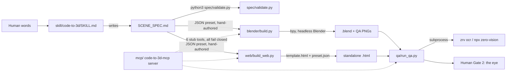

## Purpose

RealEngine turns a written scene spec into 3D output on two backends: Blender (`.blend` + QA PNGs) and Three.js (a self-contained HTML file). It is used by an agent (or a human running the CLI directly) that has a `SCENE_SPEC.md` or a JSON preset ready to build. It is not a text-to-3D mesh generator, not a hosted service, and — as of this commit — not yet reachable through its own MCP server: every MCP tool fails closed.

## System diagram



```
Human -> SKILL.md -> SCENE_SPEC.md -> validate.py -> [PASS/FAIL]
                                    \-> (hand-built JSON preset)
                                          |-> build.py (bpy)   -> .blend + PNGs
                                          |-> build_web.py     -> .html
                                                |
                                                v
                                          qa/run_qa.py --renders DIR --labels ...
                                                | subprocess
                                                v
                                          zrv ocr  (zero-vision, other repo)
                                                |
                                                v
                                          Human Gate 2 (the eye)

mcp/ server: lists 6 tools, every handler returns {ok:false, error:...}
             (no wiring to build.py / build_web.py / qa yet)
```

## Components

| Component | File/dir | Job | Interface it exposes |
|---|---|---|---|
| Spec validator | `spec/validate.py` | Checks a `SCENE_SPEC.md` has all 6 required sections, well-formed hex colors, ≥1 camera, gapless build order | CLI: `python3 spec/validate.py <path>`, exit 0/1 |
| Spec schema doc | `spec/SPEC-SCHEMA.md` | Normative shape of `SCENE_SPEC.md` | Markdown reference, no code |
| Blender lib | `blender/ctd_blender/{collections,materials,cameras,qa}.py` | Collection tree, material table, camera placement, QA render + stats — all `bpy`-lazy so the package imports without Blender | Python functions (see Interfaces) |
| Blender build entrypoint | `blender/build.py` | Reads a JSON spec, drives `ctd_blender` inside Blender to produce `.blend` + QA PNGs | CLI, run inside Blender's Python (`blender --background --python build.py -- ...`, inferred — no wrapper script found) |
| Web build | `web/build_web.py` | Fills `{{slot}}` placeholders in `web/template.html` from a JSON preset, fails loud on any unbound or surviving slot | CLI: `python3 web/build_web.py <preset.json> <template.html> <out.html>` |
| Web template + preset | `web/template.html`, `web/presets/brain.json` | The one working example: brain scene template and its preset | Slot contract, see Interfaces |
| QA asserts | `qa/asserts.py` | `labels_present` (OCR via zero-vision subprocess), `views_match` (PNG dimension compare, stdlib PNG IHDR reader, no PIL), `no_overlap` (stub, raises `NotImplementedError`) | Python functions |
| QA CLI | `qa/run_qa.py` | Runs `labels_present` over every PNG in a directory | CLI: `python3 qa/run_qa.py --renders DIR --labels CSV`, exit 0 iff all pass |
| MCP server | `mcp/src/index.ts`, `mcp/src/handlers.ts` | Lists the 6 tools named in every doc; every handler validates args then returns a fail-closed error naming the Wave 2 module that doesn't exist yet | MCP stdio server, `brief / spec_compile / build / views / qa_assert / export_scene` |
| Skill | `skill/code-to-3d/SKILL.md` | The 9-step workflow an agent follows by hand (skill does not call the MCP server; it names the CLI scripts directly) | Skill frontmatter + body |
| Test suite | `tests/test_all.py` | Unified stdlib `unittest` suite covering validate.py, build_web.py, qa/asserts.py, blender/build.py (import-only, no real Blender) | `python3 -m unittest discover -s tests -p 'test_*.py'` |
| Example scene | `examples/brain/` | The one real, finished scene: hand-built `SCENE_SPEC.md`, a chain of numbered ad hoc Blender scripts (`01_rebuild.py` … `11_final_adjustments.py`), and final renders/blends. Predates the generalized `ctd_blender` lib — not proof the generalized pipeline runs end to end | Files only, no shared interface |
| Pages portal | `index.html` | Public marketing/docs page (GitHub Pages) describing the pitch and the 6 MCP verbs as if live | Static HTML |
| Build tracker | `tracker.html` | Public build-progress page (GitHub Pages) | Static HTML |
| CI | `.github/workflows/ci.yml`, `pages.yml` | Python syntax check, unit tests, spec validation, deterministic web-build diff, MCP `npm ci && build && test` | GitHub Actions, green on `main` as of this commit (verified via `gh run list`) |

## Interfaces

| Name | Shape | Consumer |
|---|---|---|
| `spec/validate.py <path>` | CLI, stdin: none, stdout: `PASS`/`FAIL` + reasons, exit 0/1 | Skill step 5, CI, any agent |
| `SCENE_SPEC.md` schema | Markdown with 6 required H2-ish sections: Units, Palette, Collections, Cameras (≥1 `CAM_*`), Build order (gapless `01..NN`), Priority rule | Human + validator + (in principle) build scripts, but `build.py`/`build_web.py` actually consume JSON, not this Markdown — no code parses `SCENE_SPEC.md` into a build input today |
| `web/build_web.py <preset.json> <template.html> <out.html>` | CLI. Preset: flat JSON object, one key per `{{slot}}`. Fails loud (stderr + exit 1/2) on missing preset, unbound slot, or surviving `{{...}}` | Skill step 7, CI (diffs output against `web/examples/brain-v2.html`) |
| `blender/build.py` | CLI/module, JSON spec input (`{"scene", "collections", "palette", "cameras", "views"}`, all keys optional with defaults), imports `bpy` only inside `build()` — importable without Blender installed | Skill step 7, run inside headless Blender (invocation wrapper not found in-repo) |
| `qa/run_qa.py --renders DIR --labels CSV` | CLI, exit 0 iff every PNG's OCR text contains every label (case-insensitive substring) | Skill step 8, CI does not currently call this (CI never runs OCR) |
| `qa/asserts.labels_present(png, labels)` | Python function, shells out to `zrv ocr <png> --engine tesseract` (or `npx -y -p zero-vision zrv ocr` if `zrv` not on PATH); override via `ZERO_VISION_CMD` / `ZERO_VISION_ENGINE` env vars | `run_qa.py`, tests |
| MCP tools `brief, spec_compile, build, views, qa_assert, export_scene` | MCP stdio server, JSON Schema per tool (see `mcp/src/index.ts`). **Every handler validates args, then unconditionally returns `{ok: false, error: "<verb> lands in Wave 2 ..."}`.** No tool performs any real work | Documented as the primary agent surface in README/SPEC/TECH-DESIGN/index.html; unverified as functional — it is not |
| `blender.ctd_blender` public functions | `ensure_collection_tree`, `get_collection_map`, `hex_to_linear`, `make_material`, `build_material_table`, `aim_camera`, `create_camera`, `aim_cameras`, `render_view`, `collect_stats` — plain Python, `bpy` imported lazily inside function bodies | `build.py`, tests (import-only, not execution, since no `bpy` in CI) |

## Data & state

- Persisted: `.blend` files and PNGs written to disk by `build.py`/`qa.render_view` (paths passed as args, no fixed output directory convention found beyond `examples/brain/`).
- Persisted: generated `.html` scenes written wherever the caller points `build_web.py`'s output path.
- Persisted: `examples/brain/manifest.json` — a hand-maintained record for that one example (not machine-generated by any script in this repo).
- Cached: none — no build cache, no incremental-build state, no `.gitignore`d scratch dir referenced by the build scripts themselves (repo `.gitignore` only excludes Blender temp files, node_modules, dist/build, `*.traineddata`, `.env`, `*.log`).
- Never stored: no secrets, no API keys, no cloud credentials in any script read. `qa/asserts.py`'s `npx` fallback can reach the network (npm registry) to fetch `zero-vision`; nothing else calls out.
- MCP server: fully stateless — `brief`'s docstring says it "records" a prompt, but the current handler persists nothing (see Interfaces row above).

## Cross-product edges

| Other product | Direction | Mechanism | Contract file |
|---|---|---|---|
| zero-vision | RealEngine → zero-vision | Subprocess: `qa/asserts.py` calls `zrv ocr <png> --engine tesseract` if `zrv` is on PATH, else `npx -y -p zero-vision zrv ocr` | `qa/asserts.py` (no shared schema file; plain text stdout, parsed as a substring search) |
| pet-talk | none | Grepped both repos; no reference to pet-talk in realengine and no reference to realengine in pet-talk's code (one unrelated docs file in a pet-talk worktree mentions "realengine" as a cross-product-edges table entry, not a real call) | — |
| Every other product in `~/code` | none found | — | — |

## Invariants

1. `blender/ctd_blender` and `blender/build.py` must import cleanly with no `bpy` installed (module-level `import bpy` forbidden) — enforced by CI's "Python syntax check" + `import build` in `tests/test_all.py`, but note CI never actually runs the Blender build (no headless Blender in the CI image).
2. Every `{{slot}}` in `web/template.html` must have a matching preset key, and no `{{`/`}}` may survive substitution — enforced by `web/build_web.py`'s own fail-loud checks and by CI's deterministic-build diff against `web/examples/brain-v2.html`.
3. `SCENE_SPEC.md` must carry all 6 required sections, well-formed hex colors, ≥1 `CAM_*` camera, and a gapless build order — enforced by `spec/validate.py`, exercised in `tests/test_all.py` and CI.
4. MCP tool args must be validated before any fail-closed error is returned (e.g. `build` rejects a missing `spec_path` before naming the missing backend) — enforced by `mcp/test/smoke.test.js` (unverified in detail; not read line-by-line this pass).
5. No hardcoded `/Users/` paths in the Blender lib (per SPEC.md section 4) — unenforced by any grep in CI as far as I found; SPEC.md claims "grep `/Users/` MUST be empty" but no CI step runs that grep.

## Known gaps

- MCP server is 100% fail-closed stubs — none of the 6 tools do real work. (2026-09-12)
- No prompt→spec compiler exists in `spec/` despite SPEC.md's tree contract listing one; specs are hand-written today. (2026-09-12)
- `build.py` and `build_web.py` consume JSON, not the `SCENE_SPEC.md` Markdown the schema and skill describe as "the only artifact both read" — nothing in the repo converts one to the other. (2026-09-12)
- `qa/asserts.no_overlap` is an explicit stub (`NotImplementedError`); label-overlap is human-eye-only today, contradicting the "machine QA loop... before asking the human eye" framing in README/TECH-DESIGN. (2026-09-12)
- CI never invokes Blender (no headless bpy in the CI image) or `qa/run_qa.py` (no OCR/zero-vision call) — the "machine QA loop" and the Blender backend are both untested by CI. (2026-09-12)
- No wrapper script or documented invocation for running `blender/build.py` inside headless Blender (`blender --background --python ...`) was found in the repo. (2026-09-12)
- `examples/brain/`'s numbered scripts (`01_rebuild.py` … `11_final_adjustments.py`) predate `ctd_blender` and don't use it — the one real finished scene isn't built by the generalized pipeline. (2026-09-12)
- `index.html` (Pages portal) presents the 6 MCP verbs as live, shipped capability with no caveat about Wave 2. (2026-09-12)

## Changelog

| Version | Date | Change | Commit |
|---|---|---|---|
| 1.0.0 | 2026-09-12 | Initial living ARCHITECTURE.md, written from the code as of `a96785c` | a96785c (docs added on `docs/living-architecture`) |
