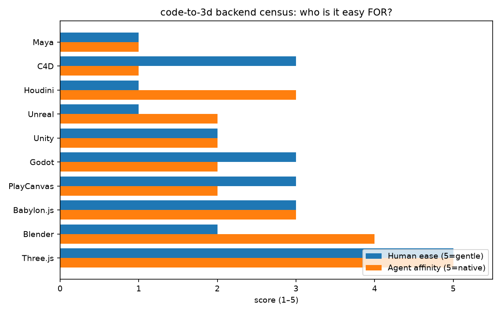
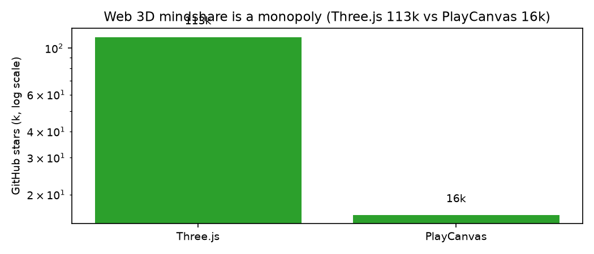
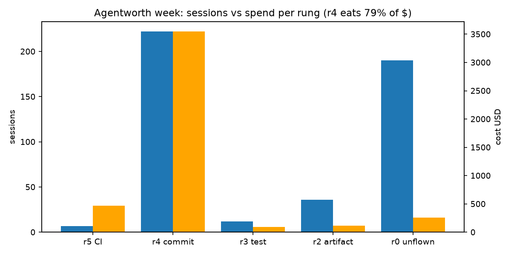

# Backend census (Sep 2026)

Source charts: `charts/` (built by `charts.py`, data below). Prices approx;
stars/downloads verified at census time.

## Human ease vs agent affinity

Only Three.js scores high on both axes. Blender is the inverse bet — cliff
for humans, richest agent story in the heavyweight class. That gap is the
code-to-3d arbitrage: where humans suffer most and agents fly best.

## Web mindshare monopoly

Three.js 113k stars vs PlayCanvas 16k — even on a log scale there is no
second contender. No decision to make for the web backend.

## Verdicts

- RIDE: Blender (only heavyweight with a real MCP story + headless bpy +
  free), Three.js (agents dream in HTML/JS).
- WATCH: Babylon.js — better-structured, Microsoft-backed, 1/300th the
  downloads. Support on first paying ask.
- INTEGRATE at the file border (FBX, glTF, USD): Unity, Unreal, Houdini.
- SKIP: PlayCanvas (cloud editor), Godot (game-shaped).
- ROUTE AROUND: seat-licensed API-less DCC silos (old-guard C4D/Maya).
  They die of irrelevance inside the agent loop; our exports stay
  importable so the door stays open.

## Spend discipline (Agentworth week, 467 sessions)

r4 (commit observed) eats 79% of spend with verification assumed, not
checked. The QA loop's business case in one number: push r4 spend toward
r3's $1.33 median test-pass.
